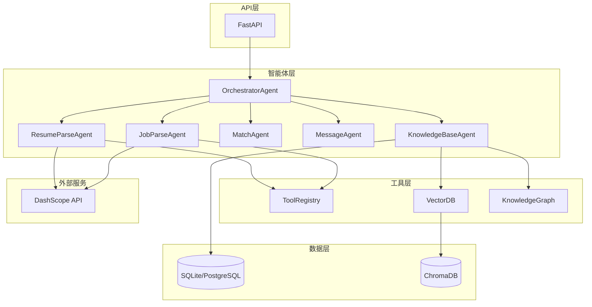
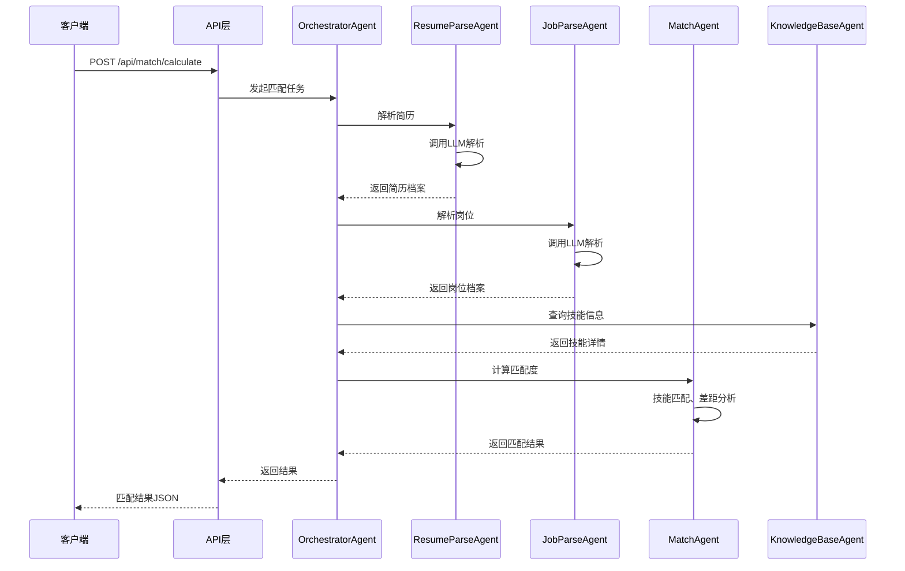

# Talent Match System Backend

人才智能匹配系统后端服务

## 项目结构

```
backend/
├── main.py                    # FastAPI 应用入口
├── requirements.txt           # 依赖列表
├── .env.example               # 环境变量模板
├── modules/
│   ├── agents/               # 智能体模块
│   │   ├── orchestrator.py    # 编排智能体（核心调度）
│   │   ├── resume_agent.py    # 简历解析智能体
│   │   ├── job_agent.py       # 岗位解析智能体
│   │   ├── match_agent.py     # 匹配智能体
│   │   ├── message_agent.py   # 消息智能体
│   │   ├── knowledge_base_agent.py  # 知识库智能体
│   │   ├── base_parse_agent.py      # 解析基类
│   │   ├── factory.py         # 智能体工厂
│   │   └── tools/             # 工具系统
│   ├── common/               # 公共模块
│   │   ├── config.py          # 配置管理
│   │   ├── exceptions.py      # 自定义异常
│   │   └── logging.py         # 日志配置
│   ├── knowledge_base/        # 知识库模块
│   │   ├── service.py         # 知识库服务
│   │   ├── db.py              # 数据库操作
│   │   ├── vector_db.py       # 向量数据库
│   │   └── graph.py           # 知识图谱
│   ├── auth/                  # 认证模块
│   ├── resume/                # 简历模块
│   ├── job/                   # 岗位模块
│   ├── match/                 # 匹配模块
│   └── message/               # 消息模块
├── utils/                     # 工具函数
│   ├── qwen_client.py         # 通义千问客户端
│   └── prompt_templates.py    # Prompt 模板
├── models/                    # 数据库模型
└── tests/                     # 测试用例
```

## 核心智能体

| 智能体 | 功能 | 文件 |
|--------|------|------|
| **OrchestratorAgent** | 任务编排和调度 | [orchestrator.py](modules/agents/orchestrator.py) |
| **ResumeParseAgent** | 简历解析和标准化 | [resume_agent.py](modules/agents/resume_agent.py) |
| **JobParseAgent** | 岗位解析和标准化 | [job_agent.py](modules/agents/job_agent.py) |
| **MatchAgent** | 人岗匹配和分析 | [match_agent.py](modules/agents/match_agent.py) |
| **MessageAgent** | 消息处理和会话管理 | [message_agent.py](modules/agents/message_agent.py) |
| **KnowledgeBaseAgent** | 知识库查询和推荐 | [knowledge_base_agent.py](modules/agents/knowledge_base_agent.py) |

## 快速开始

### 1. 安装依赖

```bash
pip install -r requirements.txt
```

### 2. 配置环境变量

复制 `.env.example` 为 `.env` 并配置：

```bash
cp .env.example .env
```

编辑 `.env` 文件：

```env
# 通义千问 API Key（必填）
DASHSCOPE_API_KEY=your_api_key_here

# 数据库配置
DATABASE_URL=sqlite:///./talent_match.db

# 日志配置
LOG_LEVEL=INFO
```

### 3. 启动服务

```bash
python main.py
```

服务将在 `http://localhost:8000` 启动。

### 4. 访问文档

- Swagger UI: `http://localhost:8000/api/docs`
- ReDoc: `http://localhost:8000/api/redoc`

## API 接口

### 认证接口
- `POST /api/user/login` - 用户登录
- `POST /api/user/register` - 用户注册

### 简历接口
- `POST /api/resume/upload` - 上传简历
- `GET /api/resume/{id}` - 获取简历详情
- `PUT /api/resume/{id}` - 更新简历
- `DELETE /api/resume/{id}` - 删除简历

### 岗位接口
- `POST /api/job/create` - 创建岗位
- `GET /api/job/{id}` - 获取岗位详情
- `PUT /api/job/{id}` - 更新岗位
- `DELETE /api/job/{id}` - 删除岗位

### 匹配接口
- `POST /api/match/calculate` - 计算匹配度
- `GET /api/match/{resume_id}/{job_id}` - 获取匹配结果

### 智能体接口
- `GET /api/agents/status` - 获取智能体状态
- `POST /api/agents/parse/resume` - 解析简历
- `POST /api/agents/parse/job` - 解析岗位

## 配置说明

| 配置项 | 说明 | 默认值 |
|--------|------|--------|
| `API_HOST` | API 监听地址 | 0.0.0.0 |
| `API_PORT` | API 监听端口 | 8000 |
| `DEBUG` | 调试模式 | true |
| `DASHSCOPE_API_KEY` | 通义千问 API Key | - |
| `QWEN_MODEL` | 模型名称 | qwen-turbo |
| `QWEN_TIMEOUT` | API 超时时间（秒） | 60 |
| `QWEN_MAX_RETRIES` | 最大重试次数 | 3 |
| `DATABASE_URL` | 数据库连接字符串 | sqlite:///./talent_match.db |
| `LOG_LEVEL` | 日志级别 | INFO |

## 运行测试

```bash
python -m unittest tests.test_agents -v
```

## 技术栈

- **框架**: FastAPI 0.100+
- **数据库**: SQLite（生产环境可切换为 PostgreSQL）
- **大模型**: 阿里云通义千问
- **向量数据库**: ChromaDB
- **认证**: JWT
- **测试**: unittest

## 架构特点

1. **自研 Agent 框架**: 轻量级、高定制化
2. **模块化设计**: 清晰的模块划分
3. **优雅降级**: 支持多种降级策略
4. **配置管理**: 集中化配置，支持环境变量
5. **日志系统**: 统一日志管理

## 架构图



## 智能体协作流程



## 开发指南

### 添加新智能体

1. 创建智能体类，继承适当的基类
2. 在 `factory.py` 中注册智能体
3. 添加相应的测试用例

### 添加新工具

1. 创建工具类，继承 `BaseTool`
2. 在 `tools/registry.py` 中注册工具
3. 在智能体中使用工具

## License

MIT License
